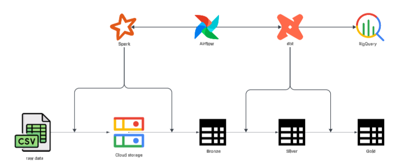
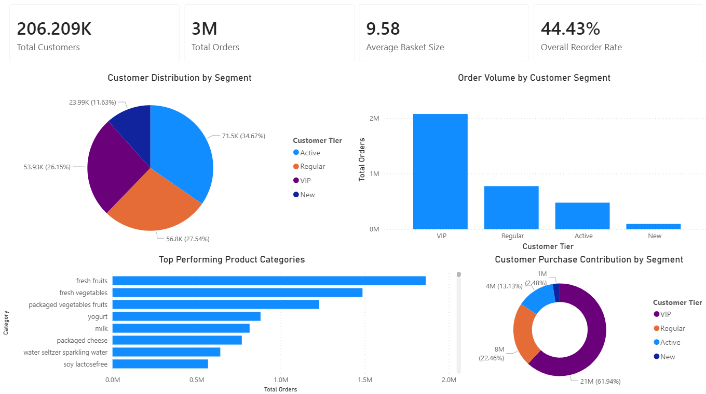

# Instacart Market Basket Analysis
> *Turning raw Instacart data into meaningful insights through a simple data pipeline*
## Overview

This project processes the Instacart Market Basket Analysis dataset, focusing on transforming raw grocery order data into a structured format to serve analysis.

---

## System Architecture

**Bronze layer**: The ingestion point for raw CSV data, where data is kept in its original form to preserve the source of truth. It is then converted into Parquet format to improve storage efficiency and speed up downstream processing

**Silver layer**: Data is structured into dimension and fact tables with basic quality checks to ensure consistency

**Gold layer**: This layer prepares data in BigQuery for analysis by aggregating tables into data marts using dbt, enabling business insights such as customer behavior and market basket analysis



---

## Data Source
The architecture is built on the Instacart Market Basket Analysis dataset, which serves as the foundation for the data processing pipeline. The dataset is available at: [Instacart Market Basket Analysis](https://www.kaggle.com/datasets/psparks/instacart-market-basket-analysis)

---

## Dashboard
The dashboard provides an overview of customer behavior and product performance based on the processed data. It helps explore key business trends such as purchasing patterns, customer segmentation, and product popularity



## Folder Structure
```
Data-Engineer
├───config
├───dags
│   ├───configs
│   │   ├───bronze
│   │   ├───gold
│   │   └───silver
│   └───root
├───data
│   └───raw
├───docker
│   ├───airflow
│   └───spark
├───image
├───instacart
│    └──models
│       ├───gold
│       └───silver
├───jars
├───notebooks
├───plugins
│   ├───generators
│   └───models
├───src
│   ├───ingestion
│   └───utils
├── docker-compose.yaml
└── README.md
```